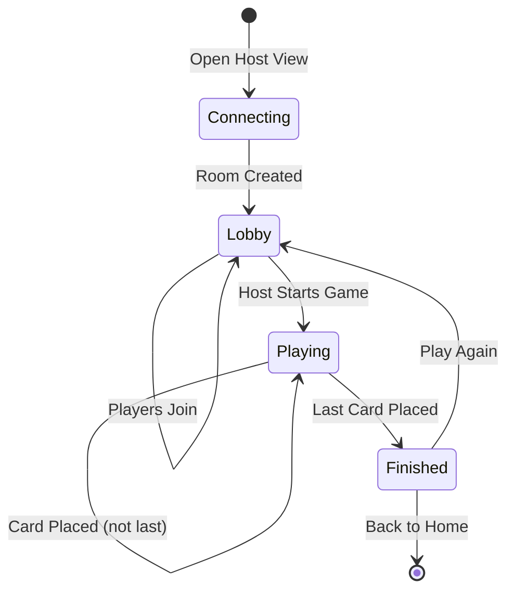

# Timeline Game: Complete Implementation Guide

This document provides comprehensive documentation for the Timeline game, covering game rules, mechanics, data structures, UI components, server logic, and implementation details for migration to Next.js + PartyKit.

---

## Table of Contents

1. [Game Overview](#1-game-overview)
2. [Game Rules & Mechanics](#2-game-rules--mechanics)
3. [Event Data Structure](#3-event-data-structure)
4. [Server-Side Game Logic](#4-server-side-game-logic)
5. [Room Management & Game Flow](#5-room-management--game-flow)
6. [WebSocket Events](#6-websocket-events)
7. [Host View (TV Screen)](#7-host-view-tv-screen)
8. [Controller View (Player Phone)](#8-controller-view-player-phone)
9. [UI Components](#9-ui-components)
10. [Design Specifications](#10-design-specifications)
11. [Migration Checklist](#11-migration-checklist)

---

## 1. Game Overview

**Timeline** is a multiplayer chronological ordering game where players:
- View historical events on their phones
- Position events on a shared timeline displayed on a TV/screen
- Score points by correctly placing events in chronological order

### Core Concept
- One player active at a time
- Active player gets an event card (with title, category, image) **without the year shown**
- Player positions the card on the timeline using left/right arrows
- Player confirms placement
- The year is revealed and card is placed in correct position
- Player scores 1 point if their placement was correct
- Next player's turn begins

---

## 2. Game Rules & Mechanics

### 2.1 Game Setup

**Players:** 1-5 players  
**Configurable Setting:** Rounds per player (1-10, default: 5)  
**Total Cards:** [(Number of Players × Rounds per Player) + 1](file:///home/clickout/Projekty/lesury/client/src/App.jsx#12-35)
- The +1 is for the initial timeline card
- Example: 3 players, 5 rounds each = 16 cards total (15 + 1 initial)

### 2.2 Game Initialization

1. **Room Creation:**
   - Host opens host view
   - System generates 4-character room code (uppercase letters + numbers, excluding ambiguous characters)
   - Characters used: `ABCDEFGHJKLMNPQRSTUVWXYZ23456789` (no O, I, 0, 1)

2. **Player Joining:**
   - Players scan QR code or manually enter room code
   - Enter nickname (max 12 characters, must be unique in room)
   - Wait in lobby until host starts

3. **Game Start:**
   - Shuffle all 20 available events
   - Take first N cards needed for the game
   - Place first card on timeline (this card's year IS visible)
   - Deal second card to first player (year hidden)

### 2.3 Gameplay Loop

**Each Turn:**

1. **Active Player's Phone Shows:**
   - Event title (e.g., "Moon Landing (Apollo 11)")
   - Event category with icon (e.g., 🚀 Space)
   - Category-colored badge
   - Instruction: "Use the arrows to position, then place!"

2. **TV Screen Shows:**
   - Horizontal scrollable timeline with all placed cards (years visible)
   - Active player's new card at current position (year hidden)
   - Placement slots between/around existing cards
   - Current player name highlighted

3. **Player Actions:**
   - Press **LEFT arrow** to move card left (towards earlier years)
   - Press **RIGHT arrow** to move card right (towards later years)
   - Active position shows preview of card with dashed border
   - Press **PLACE button** (center checkmark) to confirm

4. **After Placement:**
   - Year is revealed with animation
   - If **correct**: ✓ shows in green (sage), player scores +1
   - If **incorrect**: ✗ shows in red (antiqueBrass), no points
   - Card moves to its correct chronological position
   - Timeline updates with new card
   - Scores update
   - 1.5 second delay for feedback
   - Next player's turn begins

### 2.4 Turn Order

- Players take turns in round-robin fashion
- Order: Player 1 → Player 2 → ... → Player N → Player 1 (repeat)
- Each player gets exactly `roundsPerPlayer` turns

### 2.5 Positioning System

**Position Index:**
- `0` = Before first card
- `1` = Between first and second card  
- `2` = Between second and third card
- `timeline.length` = After last card

**Initial Position:** New cards start at `Math.floor(timeline.length / 2)` (middle of timeline)

**Validation:**
```javascript
// Card is correct if its year fits between adjacent cards
leftYear <= cardYear <= rightYear
```

### 2.6 Scoring

- **+1 point** for correct placement
- **0 points** for incorrect placement
- Final scores displayed in descending order
- Winner is player with highest score
- Ties are possible (multiple winners)

### 2.7 Game End

Game ends when: `cardsPlaced >= totalCards`

**Game Over Screen Shows:**
- Trophy icon 🏆
- Final scores ranked
- Winner(s) highlighted
- Options: Play Again or Back to Home

---

## 3. Event Data Structure

### 3.1 Event Object Schema

```typescript
interface Event {
  id: number;           // Unique identifier (1-20)
  title: string;        // Event name
  year: number;         // Year when event occurred
  category: string;     // Event category
  imageUrl: string;     // Path to event image
}
```

### 3.2 Event Categories & Styling

```javascript
const categoryStyles = {
  Science: { icon: '🔬', color: '#6A9BCC' },  // mutedBlue
  Tragedy: { icon: '💔', color: '#CC785C' },  // antiqueBrass
  War:     { icon: '⚔️', color: '#CC785C' },  // antiqueBrass
  Economy: { icon: '📈', color: '#788C5D' },  // sage
  Tech:    { icon: '💻', color: '#6A9BCC' },  // mutedBlue
  Space:   { icon: '🚀', color: '#D97757' },  // terracotta
  Politics:{ icon: '🏛️', color: '#788C5D' }   // sage
}
```

### 3.3 Complete Event Dataset

20 events spanning 1903-2022:

```javascript
[
  { id: 1,  title: "Wright Brothers' First Flight",       year: 1903, category: "Science",  imageUrl: "/images/events/event_01_flight.png" },
  { id: 2,  title: "Sinking of the Titanic",             year: 1912, category: "Tragedy",  imageUrl: "/images/events/event_02_titanic.png" },
  { id: 3,  title: "Start of World War I",               year: 1914, category: "War",      imageUrl: "/images/events/event_03_ww1.png" },
  { id: 4,  title: "Discovery of Penicillin",            year: 1928, category: "Science",  imageUrl: "/images/events/event_04_penicillin.png" },
  { id: 5,  title: "Stock Market Crash (Great Depression)", year: 1929, category: "Economy", imageUrl: "/images/events/event_05_crash.png" },
  { id: 6,  title: "Start of World War II",              year: 1939, category: "War",      imageUrl: "/images/events/event_06_ww2.png" },
  { id: 7,  title: "First Computer (ENIAC) Unveiled",    year: 1946, category: "Tech",     imageUrl: "/images/events/event_07_eniac.png" },
  { id: 8,  title: "DNA Double Helix Discovered",        year: 1953, category: "Science",  imageUrl: "/images/events/event_08_dna.png" },
  { id: 9,  title: "First Human in Space (Yuri Gagarin)", year: 1961, category: "Space",   imageUrl: "/images/events/event_09_gagarin.png" },
  { id: 10, title: "Moon Landing (Apollo 11)",           year: 1969, category: "Space",    imageUrl: "/images/events/event_10_apollo.png" },
  { id: 11, title: "Fall of the Berlin Wall",            year: 1989, category: "Politics", imageUrl: "/images/events/event_11_berlin.png" },
  { id: 12, title: "Launch of the World Wide Web",       year: 1991, category: "Tech",     imageUrl: "/images/events/event_12_www.png" },
  { id: 13, title: "Euro Currency Introduced",           year: 1999, category: "Economy",  imageUrl: "/images/events/event_13_euro.png" },
  { id: 14, title: "Wikipedia Launched",                 year: 2001, category: "Tech",     imageUrl: "/images/events/event_14_wikipedia.png" },
  { id: 15, title: "Launch of the First iPhone",         year: 2007, category: "Tech",     imageUrl: "/images/events/event_15_iphone.png" },
  { id: 16, title: "Bitcoin Network Starts",             year: 2009, category: "Tech",     imageUrl: "/images/events/event_16_bitcoin.png" },
  { id: 17, title: "Curiosity Rover Lands on Mars",      year: 2012, category: "Space",    imageUrl: "placeholder" },
  { id: 18, title: "Paris Agreement on Climate Change",  year: 2015, category: "Politics", imageUrl: "placeholder" },
  { id: 19, title: "First Image of a Black Hole",        year: 2019, category: "Science",  imageUrl: "placeholder" },
  { id: 20, title: "James Webb Telescope First Images",  year: 2022, category: "Space",    imageUrl: "placeholder" }
]
```

> [!NOTE]
> Events 17-20 use placeholder images in the MVP. You can generate actual images or use proper placeholders.

---

## 4. Server-Side Game Logic

### 4.1 Core Validation Function

```javascript
/**
 * Validates if placing a card at the given position is chronologically correct
 * @param {Array} timeline - Current timeline of placed cards
 * @param {Object} card - Card being placed (with year property)
 * @param {number} position - Position to place (0-based index)
 * @returns {boolean} - True if placement is correct
 */
function validatePlacement(timeline, card, position) {
  const year = card.year;
  
  // Get the years of adjacent cards
  const leftCard = position > 0 ? timeline[position - 1] : null;
  const rightCard = position < timeline.length ? timeline[position] : null;
  
  const leftYear = leftCard ? leftCard.year : -Infinity;
  const rightYear = rightCard ? rightCard.year : Infinity;
  
  // Card year must be between left and right (inclusive)
  return year >= leftYear && year <= rightYear;
}
```

### 4.2 Correct Position Calculation

```javascript
/**
 * Calculates the correct position for a card in the timeline
 * @param {Array} timeline - Current timeline of placed cards
 * @param {Object} card - Card being placed
 * @returns {number} - Correct position index
 */
function calculateCorrectPosition(timeline, card) {
  const year = card.year;
  
  // Find the first card with a year >= this card's year
  for (let i = 0; i < timeline.length; i++) {
    if (timeline[i].year >= year) {
      return i;
    }
  }
  
  // Card goes at the end
  return timeline.length;
}
```

### 4.3 Shuffle Algorithm

```javascript
/**
 * Shuffles an array using Fisher-Yates algorithm
 * @param {Array} array - Array to shuffle
 * @returns {Array} - Shuffled copy of array
 */
function shuffleArray(array) {
  const shuffled = [...array];
  for (let i = shuffled.length - 1; i > 0; i--) {
    const j = Math.floor(Math.random() * (i + 1));
    [shuffled[i], shuffled[j]] = [shuffled[j], shuffled[i]];
  }
  return shuffled;
}
```

---

## 5. Room Management & Game Flow

### 5.1 Room State Structure

```typescript
interface Room {
  code: string;              // 4-character room code
  hostId: string;            // Socket ID of host
  players: Player[];         // Array of players
  gameState: GameState | null;
  settings: {
    roundsPerPlayer: number; // 1-10, default: 5
  };
  status: 'lobby' | 'playing' | 'finished';
}

interface Player {
  id: string;          // Socket ID
  nickname: string;    // Display name (max 12 chars)
  score: number;       // Current score
  connected: boolean;  // Connection status
}

interface GameState {
  timeline: Event[];          // Placed cards (years visible)
  deck: Event[];              // Remaining cards
  currentCardIndex: number;   // Index in deck
  currentCard: Event;         // Card being placed
  currentPlayerIndex: number; // Index in players array
  currentPosition: number;    // Current placement position
  cardsPlaced: number;        // Cards placed so far
  totalCards: number;         // Total cards to place
}
```

### 5.2 Game Flow State Machine



### 5.3 Key Server Functions

#### Create Room
```javascript
createRoom(hostId) {
  const code = generateRoomCode(); // 4 chars
  const room = {
    code,
    hostId,
    players: [],
    gameState: null,
    settings: { roundsPerPlayer: 5 },
    status: 'lobby'
  };
  return room;
}
```

#### Join Room
```javascript
joinRoom(roomCode, playerId, nickname) {
  // Validation
  if (!room) return { success: false, error: 'Room not found' };
  if (room.status !== 'lobby') return { success: false, error: 'Game already in progress' };
  if (room.players.length >= 5) return { success: false, error: 'Room is full (max 5 players)' };
  if (nicknameExists) return { success: false, error: 'Nickname already taken' };
  
  // Add player
  room.players.push({ id: playerId, nickname, score: 0, connected: true });
  return { success: true, room };
}
```

#### Start Game
```javascript
startGame(roomCode, hostId) {
  const totalCardsNeeded = players.length * settings.roundsPerPlayer + 1;
  
  // Shuffle and select cards
  const shuffled = shuffleArray(allEvents);
  const deck = shuffled.slice(0, totalCardsNeeded);
  
  // Initialize timeline with first card
  const initialCard = deck.shift();
  
  room.gameState = {
    timeline: [initialCard],
    deck,
    currentCardIndex: 0,
    currentCard: deck[0],
    currentPlayerIndex: 0,
    currentPosition: 0,
    cardsPlaced: 0,
    totalCards: players.length * settings.roundsPerPlayer
  };
  
  room.status = 'playing';
}
```

#### Move Card
```javascript
moveCard(roomCode, playerId, direction) {
  // Validate it's player's turn
  if (currentPlayer.id !== playerId) return { success: false, error: 'Not your turn' };
  
  const maxPosition = timeline.length;
  
  if (direction === 'left' && currentPosition > 0) {
    currentPosition--;
  } else if (direction === 'right' && currentPosition < maxPosition) {
    currentPosition++;
  }
  
  return { success: true, position: currentPosition };
}
```

#### Place Card
```javascript
placeCard(roomCode, playerId) {
  const card = gameState.currentCard;
  const placedPosition = gameState.currentPosition;
  
  // Validate placement
  const isCorrect = validatePlacement(timeline, card, placedPosition);
  const correctPosition = calculateCorrectPosition(timeline, card);
  
  // Update score if correct
  if (isCorrect) {
    currentPlayer.score++;
  }
  
  // Insert card at correct position
  timeline.splice(correctPosition, 0, card);
  
  // Advance game
  cardsPlaced++;
  currentCardIndex++;
  
  // Check game over
  const gameOver = cardsPlaced >= totalCards;
  
  if (!gameOver) {
    // Next turn
    currentPlayerIndex = (currentPlayerIndex + 1) % players.length;
    currentCard = deck[currentCardIndex];
    currentPosition = Math.floor(timeline.length / 2);
  }
  
  return { isCorrect, correctPosition, timeline, scores, gameOver, winner };
}
```

---

## 6. WebSocket Events

### 6.1 Client → Server Events

| Event | Data | Response | Description |
|-------|------|----------|-------------|
| `create-room` | `{}` | `{ success, room: { code } }` | Host creates new room |
| `join-room` | `{ roomCode, nickname }` | `{ success, playerId, room }` | Player joins room |
| `configure-game` | `{ roomCode, roundsPerPlayer }` | `{ success }` | Host sets game settings |
| `start-game` | `{ roomCode }` | `{ success, gameState }` | Host starts game |
| `move-card` | `{ roomCode, direction: 'left'|'right' }` | `{ success, position }` | Player moves card |
| `place-card` | `{ roomCode }` | `{ success, ...placementData }` | Player places card |

### 6.2 Server → Client Events

| Event | Recipient | Data | Description |
|-------|-----------|------|-------------|
| `player-joined` | All in room | `{ players }` | New player joined |
| `player-disconnected` | All in room | `{ players }` | Player disconnected |
| `game-started` | All in room | `{ timeline, currentCard, currentPlayerId, currentPlayerName, players, cardsPlaced, totalCards }` | Game started |
| `card-moved` | All in room | `{ position }` | Active player moved card |
| `card-placed` | All in room | `{ card, isCorrect, correctPosition, placedPosition, timeline, scores, nextPlayer, gameOver, winner }` | Card was placed |
| `room-closed` | All players | `{}` | Host disconnected |

### 6.3 Event Flow Example

**Player Turn:**
```
1. Player presses LEFT
   → Client emits: move-card { direction: 'left' }
   → Server broadcasts: card-moved { position: 2 }
   → All screens update position

2. Player presses PLACE
   → Client emits: place-card {}
   → Server broadcasts: card-placed { 
       isCorrect: true, 
       timeline: [...updated],
       nextPlayer: {...}
     }
   → All screens show result animation
   → After 1.5s delay, show next turn
```

---

## 7. Host View (TV Screen)

### 7.1 Layout Structure

```
┌─────────────────────────────────────────┐
│  Timeline            [Player Scores]    │ ← Header (cararra bg)
├─────────────────────────────────────────┤
│                                         │
│    ←  [Card] [Slot] [Card] [Card]  →   │ ← Timeline (scrollable)
│    ════════════════════════════════     │   (cream bg)
│                                         │
├─────────────────────────────────────────┤
│  [Card Preview]    Current Turn: Alice  │ ← Footer (cararra bg)
└─────────────────────────────────────────┘
```

### 7.2 Lobby View Components

**Layout:** Horizontal split on desktop, vertical on mobile

**Left Side:**
- QR Code display (200×200px)
- Room code in large mono font
- Rounds per player selector (−/+buttons)

**Right Side:**
- "Players" heading
- Player list with names
- "Start Game" button (disabled if no players)

### 7.3 Game View Components

**Header Bar:**
- "Timeline" title (left)
- Player list showing all players with scores (right)
- Active player highlighted with terracotta color
- Background: cararra, border-bottom: lightGray

**Main Timeline Area:**
- Horizontal scrollable container
- Timeline line (1px height, lightGray)
- Event cards showing year
- Placement slots between cards (dashed border when active)
- Active card preview at current position (scaled 90%)
- Auto-scrolls to keep active slot centered
- Gradient fade on edges when scrollable

**Footer Bar:**
- Left: Current card preview (thumbnail + title + category)
- Right: "Current Turn" label + active player name (terracotta)
- Background: cararra, border-top: lightGray

### 7.4 Timeline Component Behavior

**Placement Slots:**
- Inactive slots: 8px wide, lightGray/50
- Active slot: 160px wide, terracotta/20 bg, dashed border
- Active card shows inside active slot at 90% scale
- Smooth width animation (300ms)

**Card Placement Animation:**
- When card placed, it animates to correct position
- If incorrect, briefly shows red highlight
- If correct, briefly shows green highlight
- Timeline updates with spring animation
- All cards reposition smoothly using Framer Motion layout prop

**Result State:**
- During 1.5s feedback delay:
  - Card shows border color (green/red)
  - Card shows background tint
  - Year is now visible on the card

**Auto-scroll Logic:**
```javascript
// Keep active slot centered
const slotCenter = slot.offsetLeft + slot.offsetWidth / 2;
const containerCenter = container.offsetWidth / 2;
const scrollTo = slotCenter - containerCenter;
container.scrollTo({ left: scrollTo, behavior: 'smooth' });
```

---

## 8. Controller View (Player Phone)

### 8.1 Screen States

The controller has 4 main states:

1. **Join Screen** - Enter room code + nickname
2. **Waiting Screen** - Waiting for host to start
3. **Game Screen** - Active gameplay
4. **Finished Screen** - Final scores

### 8.2 Join Screen

```
┌──────────────────┐
│   Join Game      │
├──────────────────┤
│ Room Code        │
│ ┌──────────────┐ │
│ │    ABCD      │ │ ← 4-char uppercase input
│ └──────────────┘ │
│                  │
│ Nickname         │
│ ┌──────────────┐ │
│ │  Your name   │ │ ← Max 12 chars
│ └──────────────┘ │
│                  │
│ ┌──────────────┐ │
│ │     Join     │ │ ← Dark button
│ └──────────────┘ │
│                  │
│  Back to Home    │
└──────────────────┘
```

**Styling:**
- Room code: Large mono font, center-aligned, uppercase
- Nickname: Center-aligned, semibold
- Inputs: cararra background, lightGray border, focus border: terracotta
- Join button: Disabled if fields empty or not connected

### 8.3 Waiting Screen

```
┌──────────────────┐
│                  │
│      ⏳          │ ← Pulsing opacity animation
│                  │
│  Waiting for     │
│  host to start   │
│                  │
│  Room: ABCD      │
│  Alice           │ ← Player's nickname in terracotta
│                  │
└──────────────────┘
```

### 8.4 Game Screen

**Top 2/3: Event Information** (cararra background)

**If Your Turn:**
```
┌───────────────────┐
│  🚀 SPACE         │ ← Category badge (colored)
│                   │
│  Moon Landing     │ ← Event title (large, bold)
│  (Apollo 11)      │
│                   │
│  Use the arrows   │
│  to position,     │ ← Instructions
│  then place!      │
└───────────────────┘
```

**If Not Your Turn:**
```
┌───────────────────┐
│                   │
│       👀          │ ← Pulsing emoji
│                   │
│  Waiting for      │
│  Bob...           │ ← Active player's name
│                   │
│  Watch the TV!    │
└───────────────────┘
```

**Bottom 1/3: Control Pad** (lightGray background)

```
┌───────────────────┐
│                   │
│   ‹   ✓   ›       │ ← Left, Place, Right buttons
│                   │
└───────────────────┘
```

**Result Feedback Overlay:**
When card is placed, fullscreen overlay appears:
- Correct: ✓ (huge sage green checkmark), sage/30 background
- Incorrect: ✗ (huge antiqueBrass X), antiqueBrass/30 background
- Scale animation: 0.5 → 1 → 0.5
- Duration: 1.5 seconds

### 8.5 Finished Screen

```
┌──────────────────┐
│      🏆          │
│  Game Over!      │
├──────────────────┤
│  Your Result     │
│                  │
│    12 pts        │ ← Your score (terracotta)
│   #2 place       │ ← Your rank
├──────────────────┤
│  #1 Bob      15  │ ← All scores ranked
│  #2 Alice    12  │   (your row highlighted)
│  #3 Charlie   8  │
├──────────────────┤
│ ┌──────────────┐ │
│ │ Back to Home │ │
│ └──────────────┘ │
└──────────────────┘
```

---

## 9. UI Components

### 9.1  EventCard Component

**Props:**
```typescript
{
  event: Event;
  showYear?: boolean;        // Default: true
  isActive?: boolean;        // Default: false
  isHighlighted?: boolean;   // Default: false  
  result?: 'correct' | 'incorrect' | null;
  size?: 'small' | 'normal' | 'large'; // Default: 'normal'
}
```

**Sizes:**
- Small: 32×44 (w-32 h-44), image: h-20
- Normal: 40×56 (w-40 h-56), image: h-28
- Large: 48×64 (w-48 h-64), image: h-32

**Structure:**
```jsx
<div className="w-40 h-56 bg-cararra rounded-xl border-2 shadow-md">
  {/* Event Image (top) */}
  <div className="h-28 bg-lightGray/50">
    
    {/* Fallback: Category emoji if image fails */}
  </div>
  
  {/* Event Info (bottom) */}
  <div className="p-2 flex flex-col justify-between">
    <p className="text-xs font-semibold text-codGray line-clamp-3">
      {title}
    </p>
    <div className="flex justify-between">
      <span className="text-[10px] text-midGray uppercase">
        {category}
      </span>
      {showYear && <span className="text-sm font-bold">{year}</span>}
    </div>
  </div>
</div>
```

**Border Colors:**
- Result correct: `border-sage`
- Result incorrect: `border-antiqueBrass`
- Active: `border-terracotta`
- Highlighted: `border-mutedBlue`
- Default: `border-lightGray`

**Background Colors:**
- Result correct: `bg-sage/10`
- Result incorrect: `bg-antiqueBrass/10`
- Default: `bg-cararra`

### 9.2 Timeline Component

**Props:**
```typescript
{
  cards: Event[];
  activeCard: Event | null;
  activePosition: number;
  showPlacementSlots?: boolean;
  resultState?: {
    cardId: number;
    isCorrect: boolean;
    correctPosition: number;
  } | null;
}
```

**Structure:**
```jsx
<div className="relative w-full">
  <div ref={containerRef} className="flex items-center gap-3 overflow-x-auto">
    {/* Timeline line */}
    <div className="absolute h-1 bg-lightGray top-1/2 -translate-y-1/2" />
    
    {/* Cards and slots */}
    <div className="relative z-10 flex items-center gap-3">
      <AnimatePresence mode="popLayout">
        {/* Slot */}
        <motion.div 
          animate={{ width: isActive ? 160 : 8 }}
          className={isActive ? 'bg-terracotta/20 border-dashed border-terracotta' : 'bg-lightGray/50'}
        >
          {isActive && activeCard && <EventCard {...activeCard} />}
        </motion.div>
        
        {/* Card */}
        <motion.div layout>
          <EventCard event={card} showYear={true} />
        </motion.div>
      </AnimatePresence>
    </div>
  </div>
  
  {/* Scroll fade indicators */}
  <div className="absolute left-0 w-16 bg-gradient-to-r from-cream to-transparent" />
  <div className="absolute right-0 w-16 bg-gradient-to-l from-cream to-transparent" />
</div>
```

**Auto-scroll:**
- Triggers on `activePosition` or `cards.length` change
- Scrolls to center the active slot
- Smooth behavior

### 9.3 ControlPad Component

**Props:**
```typescript
{
  onMoveLeft: () => void;
  onMoveRight: () => void;
  onPlace: () => void;
  disabled?: boolean;
}
```

**Layout:**
```jsx
<div className="flex items-center justify-center gap-4 p-4">
  {/* Left Arrow */}
  <motion.button 
    whileTap={{ scale: 0.9 }}
    className="w-20 h-20 rounded-2xl bg-codGray text-cream text-3xl"
  >
    ‹
  </motion.button>
  
  {/* Place Button (center, larger, round) */}
  <motion.button
    whileTap={{ scale: 0.95 }}
    className="w-24 h-24 rounded-full bg-terracotta text-cream text-4xl"
  >
    ✓
  </motion.button>
  
  {/* Right Arrow */}
  <motion.button
    whileTap={{ scale: 0.9 }}
    className="w-20 h-20 rounded-2xl bg-codGray text-cream text-3xl"
  >
    ›
  </motion.button>
</div>
```

**States:**
- Enabled: `bg-codGray text-cream shadow-lg`
- Disabled: `bg-lightGray text-midGray cursor-not-allowed`
- Place button: Always `bg-terracotta` when enabled

### 9.4 PlayerList Component

**Props:**
```typescript
{
  players: Player[];
  activePlayerId: string | null;
  compact?: boolean;
}
```

**Compact Mode (Header):**
```jsx
<div className="flex gap-2">
  {players.map(player => (
    <div className={`px-3 py-1 rounded-full ${isActive ? 'bg-terracotta text-cream' : 'bg-lightGray'}`}>
      <span className="font-semibold text-sm">{player.nickname}</span>
      <span className="ml-2 font-bold">{player.score}</span>
    </div>
  ))}
</div>
```

**Full Mode (Lobby):**
```jsx
<div className="space-y-2">
  {players.map(player => (
    <div className="bg-cararra rounded-xl p-4">
      <p className="font-bold text-codGray">{player.nickname}</p>
      {!player.connected && <span className="text-xs text-midGray">(Disconnected)</span>}
    </div>
  ))}
</div>
```

### 9.5 QRCodeDisplay Component

```jsx
import QRCode from 'qrcode.react';

<div className="flex flex-col items-center gap-4">
  <QRCode 
    value={`${window.location.origin}/timeline/join/${roomCode}`}
    size={200}
    level="H"
    bgColor="#FAF9F5"
    fgColor="#141413"
  />
  <div className="text-center">
    <p className="text-sm text-midGray">Room Code</p>
    <p className="text-4xl font-mono font-bold text-codGray tracking-widest">
      {roomCode}
    </p>
  </div>
</div>
```

### 9.6 GameOverModal Component

**Full-screen overlay with:**
- Trophy icon
- "Game Over!" title
- Winner announcement
- Scores table (ranked)
- "Play Again" button (only for host)
- "Back to Home" button

```jsx
<motion.div 
  initial={{ opacity: 0 }}
  animate={{ opacity: 1 }}
  className="fixed inset-0 bg-codGray/80 flex items-center justify-center"
>
  <motion.div 
    initial={{ scale: 0.9 }}
    animate={{ scale: 1 }}
    className="bg-cream rounded-3xl p-8 max-w-md"
  >
    <div className="text-6xl text-center mb-4">🏆</div>
    <h2 className="text-3xl font-extrabold text-center mb-6">Game Over!</h2>
    
    {/* Winner */}
    <div className="bg-terracotta/20 rounded-xl p-4 mb-6">
      <p className="text-terracotta font-bold text-xl text-center">
        {winner.nickname} Wins!
      </p>
      <p className="text-center text-codGray">{winner.score} points</p>
    </div>
    
    {/* Scores */}
    <div className="space-y-2 mb-6">
      {scores.map((player, idx) => (
        <div className="flex justify-between p-3 bg-cararra rounded-xl">
          <span>#{idx + 1} {player.nickname}</span>
          <span className="font-bold">{player.score}</span>
        </div>
      ))}
    </div>
    
    {/* Buttons */}
    <button className="w-full py-4 bg-codGray text-cream rounded-xl mb-2">
      Play Again
    </button>
    <button className="w-full py-3 text-midGray">
      Back to Home
    </button>
  </motion.div>
</motion.div>
```

---

## 10. Design Specifications

### 10.1 Color Usage in Game

**Backgrounds:**
- Main screen: `bg-cream` (#FAF9F5)
- Headers/Footers: `bg-cararra` (#F0EFEA)
- Controller section: `bg-lightGray` (#E8E6DC)

**Accents:**
- Active player/turn: `text-terracotta` (#D97757)
- Correct result: `text-sage` (#788C5D), `bg-sage/10`
- Incorrect result: `text-antiqueBrass` (#CC785C), `bg-antiqueBrass/10`
- Active slot border: `border-terracotta`

**Text:**
- Primary: `text-codGray` (#141413)
- Secondary: `text-midGray` (#B0AEA5)

### 10.2 Typography

**Headings:**
- Game title: `text-6xl md:text-8xl font-extrabold`
- Section headers: `text-2xl font-bold`
- Event titles on cards: `text-xs font-semibold`

**Body:**
- Instructions: `text-xl text-midGray`
- Category labels: `text-[10px] uppercase font-medium`
- Years: `text-sm font-bold`

**Special:**
- Room codes: `font-mono font-bold tracking-widest`
- Player names: `font-bold` or `font-semibold`

### 10.3 Animations

**Framer Motion:**
```javascript
// Page entry
initial={{ opacity: 0, y: 20 }}
animate={{ opacity: 1, y: 0 }}

// Card placement
layout
transition={{ type: 'spring', stiffness: 300, damping: 25 }}

// Button press
whileTap={{ scale: 0.9 }}

// Pulsing (loading)
animate={{ opacity: [0.5, 1, 0.5] }}
transition={{ duration: 2, repeat: Infinity }}

// Result overlay
initial={{ opacity: 0, scale: 0.5 }}
animate={{ opacity: 1, scale: 1 }}
exit={{ opacity: 0, scale: 0.5 }}
```

**Delays:**
- Result feedback display: 1.5 seconds
- Timeline update after placement: immediate
- Transition to next turn: after 1.5s delay

### 10.4 Responsive Breakpoints

- Mobile: Base styles
- Tablet: `md:` prefix (768px+)
- Desktop: `lg:` prefix (1024px+)
- Large screens: `xl:` prefix (1280px+)

**Lobby Layout:**
- Mobile: Vertical stack (QR top, players bottom)
- Desktop: Horizontal (QR left, players right)

---

## 11. Migration Checklist

### 11.1 Dependencies

```json
{
  "dependencies": {
    "framer-motion": "^11.0.3",
    "qrcode.react": "^3.1.0",
    "uuid": "^9.0.0"
  }
}
```

### 11.2 Server Setup (PartyKit)

- [ ] Create PartyKit server class
- [ ] Implement room management (Map<code, Room>)
- [ ] Implement all game manager methods
- [ ] Add WebSocket event handlers
- [ ] Implement game logic functions (validate, calculate, shuffle)
- [ ] Store event dataset
- [ ] Handle connection/disconnection
- [ ] Broadcast state updates to all connections

### 11.3 Client Setup (Next.js)

**Data & Utils:**
- [ ] Create `events.ts` with event dataset and category styles
- [ ] Create `gameLogic.ts` with validation and positioning functions

**Components:**
- [ ] EventCard component
- [ ] Timeline component
- [ ] ControlPad component
- [ ] PlayerList component
- [ ] QRCodeDisplay component
- [ ] GameOverModal component

**Pages/Routes:**
- [ ] `/timeline` - Game home (start or join)
- [ ] `/timeline/host` - Host view
- [ ] `/timeline/join` - Join screen
- [ ] `/timeline/join/[code]` - Direct join with code

**Hooks:**
- [ ] `usePartySocket` - WebSocket connection to PartyKit
- [ ] Room state management (React state or Zustand)

### 11.4 Core Game Features

- [ ] Room creation with 4-char codes
- [ ] QR code generation for joining
- [ ] Player join with nickname validation
- [ ] Lobby with player list
- [ ] Rounds per player configuration
- [ ] Game initialization with shuffled deck
- [ ] Turn-based system
- [ ] Card positioning (left/right movement)
- [ ] Placement validation
- [ ] Score tracking
- [ ] Timeline auto-scroll
- [ ] Result feedback animations
- [ ] Game over detection
- [ ] Winner calculation
- [ ] Play again functionality

### 11.5 Visual & UX Features

- [ ] Framer Motion animations throughout
- [ ] Active player highlighting
- [ ] Category-colored badges
- [ ] Result overlay (correct/incorrect)
- [ ] Timeline with placement slots
- [ ] Horizontal scrolling with fade indicators
- [ ] Responsive layouts (mobile/desktop)
- [ ] Loading states
- [ ] Error handling and toasts
- [ ] Disconnection handling

### 11.6 Testing Checklist

**Single Player:**
- [ ] Create room
- [ ] Join as one player
- [ ] Start game with 1 round
- [ ] Place cards correctly
- [ ] Place cards incorrectly
- [ ] Complete game
- [ ] View final scores

**Multiple Players:**
- [ ] Join with 3+ players
- [ ] Verify turn order
- [ ] Verify score updates
- [ ] Player disconnection handling
- [ ] Host disconnection (room closes)

**Edge Cases:**
- [ ] Duplicate nicknames rejected
- [ ] Room full (6th player can't join)
- [ ] Join game in progress rejected
- [ ] Invalid room code
- [ ] Timeline with 10+ cards (scrolling)
- [ ] Tied scores
- [ ] Max rounds (10 per player)

---

## Summary

This guide provides everything needed to recreate the Timeline game in a Next.js + PartyKit environment:

✅ **Complete game rules** - Understand how the game works  
✅ **Data structures** - Events, rooms, players, game state  
✅ **Server logic** - Validation, positioning, game flow  
✅ **Client views** - Host screen and player controllers  
✅ **UI components** - All reusable pieces with exact styling  
✅ **Animations** - Framer Motion specifications  
✅ **WebSocket events** - Complete communication protocol  
✅ **Design system** - Colors, typography, spacing  

The implementation should maintain the exact same look, feel, and gameplay as the MVP while migrating to the new tech stack.
